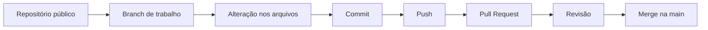

<div align="center">

# Explorando Colaboração e Markdown

### Desafio de Projeto — DIO

Repositório público desenvolvido para praticar **Git**, **GitHub**, **Markdown** e o fluxo básico de colaboração em projetos.

[](https://git-scm.com/)
[](https://github.com/)
[](https://www.markdownguide.org/)
[](https://www.dio.me/)
[](LICENSE)
[](https://github.com/matheusflorindo32/desafio-github-markdown)

[Visão geral](#visão-geral) • [Objetivos](#objetivos-do-desafio) • [Evidências](#evidências-da-execução) • [Guia Markdown](docs/guia-markdown.md) • [Comandos Git](docs/comandos-git.md) • [Como contribuir](CONTRIBUTING.md)

</div>

---

## Visão geral

Este projeto foi criado para atender ao desafio **“Explorando Colaboração e Markdown”**, da DIO. A proposta é demonstrar, de forma prática e organizada, a criação de um repositório público, o uso correto da sintaxe Markdown e a execução de um fluxo colaborativo com **branch**, **issue**, **pull request** e **merge**.

| Item | Resultado |
|---|---|
| Repositório | Público |
| Branch principal | `main` |
| Documentação | Markdown |
| Issue | Criada |
| Branch de trabalho | `feature/documentacao` |
| Pull request | Criado e integrado |
| Licença | MIT |
| Status | Concluído |

> Mais do que armazenar arquivos, um bom repositório registra decisões, facilita a colaboração e comunica com clareza o propósito do projeto.

## Objetivos do desafio

- Criar e organizar um repositório público no GitHub.
- Aplicar recursos essenciais da linguagem Markdown.
- Utilizar commits claros e descritivos.
- Praticar o trabalho com branches.
- Criar uma issue com tarefas e critérios de conclusão.
- Abrir, revisar e integrar um pull request.
- Documentar os conhecimentos adquiridos durante a atividade.

## Tecnologias e ferramentas

| Tecnologia | Aplicação no projeto |
|---|---|
| **Git** | Controle de versão e registro das alterações |
| **GitHub** | Hospedagem, colaboração, issues e pull requests |
| **Markdown** | Estruturação e formatação da documentação |
| **DIO** | Plataforma responsável pelo desafio de projeto |

## Estrutura do repositório

```text
desafio-github-markdown/
├── README.md
├── LICENSE
├── CONTRIBUTING.md
├── CODE_OF_CONDUCT.md
├── CHANGELOG.md
├── .gitignore
└── docs/
    ├── guia-markdown.md
    ├── comandos-git.md
    └── aprendizados.md
```

### Documentação complementar

| Arquivo | Finalidade |
|---|---|
| [`docs/guia-markdown.md`](docs/guia-markdown.md) | Exemplos práticos dos principais recursos de Markdown |
| [`docs/comandos-git.md`](docs/comandos-git.md) | Comandos Git utilizados no fluxo do projeto |
| [`docs/aprendizados.md`](docs/aprendizados.md) | Registro dos conhecimentos consolidados |
| [`CONTRIBUTING.md`](CONTRIBUTING.md) | Orientações para contribuições |
| [`CODE_OF_CONDUCT.md`](CODE_OF_CONDUCT.md) | Regras de convivência e participação |
| [`CHANGELOG.md`](CHANGELOG.md) | Histórico das versões e alterações |

## Conceitos praticados

- Repositórios públicos
- Controle de versão
- Commits semânticos
- Branches
- Issues
- Pull requests
- Revisão e merge
- Documentação técnica
- Colaboração em projetos

## Evidências da execução

A atividade foi desenvolvida com ações reais dentro deste repositório:

| Etapa | Evidência |
|---|---|
| Criação da issue | [Issue #1 — Melhorar exemplos de Markdown](https://github.com/matheusflorindo32/desafio-github-markdown/issues/1) |
| Criação da branch | `feature/documentacao` |
| Alteração em branch separada | Inclusão do arquivo `.gitignore` |
| Pull request | [PR #2 — docs: aprimora organização do repositório](https://github.com/matheusflorindo32/desafio-github-markdown/pull/2) |
| Integração | Pull request revisado e integrado à `main` |

## Checklist do desafio

- [x] Criar um repositório público
- [x] Configurar a branch principal `main`
- [x] Criar e aprimorar o `README.md`
- [x] Aplicar títulos, listas, links, tabelas e blocos de código
- [x] Criar documentação complementar em Markdown
- [x] Registrar comandos Git utilizados
- [x] Criar orientações para contribuição
- [x] Adicionar licença MIT
- [x] Criar uma issue com checklist
- [x] Criar a branch `feature/documentacao`
- [x] Realizar alteração em branch separada
- [x] Abrir um pull request
- [x] Integrar o pull request à branch `main`

## Exemplos rápidos de Markdown

### Formatação de texto

Texto em **negrito**, texto em *itálico* e texto ~~tachado~~.

### Lista numerada

1. Criar uma branch.
2. Realizar as alterações.
3. Registrar um commit.
4. Enviar a branch para o GitHub.
5. Abrir um pull request.

### Citação

> Markdown permite criar documentação clara, portátil e fácil de revisar.

### Bloco de código

```bash
git clone https://github.com/matheusflorindo32/desafio-github-markdown.git
cd desafio-github-markdown
git checkout -b feature/minha-contribuicao
```

Mais exemplos estão disponíveis no [`Guia de Markdown`](docs/guia-markdown.md).

## Fluxo Git utilizado



### 1. Clonar o repositório

```bash
git clone https://github.com/matheusflorindo32/desafio-github-markdown.git
cd desafio-github-markdown
```

### 2. Criar uma branch

```bash
git checkout -b feature/minha-contribuicao
```

### 3. Registrar e enviar as alterações

```bash
git add .
git commit -m "docs: adiciona nova contribuição"
git push origin feature/minha-contribuicao
```

### 4. Abrir um pull request

No GitHub, compare a branch criada com a `main`, descreva as alterações realizadas e envie o pull request para revisão.

## Padrão de commits

Neste projeto, as mensagens seguem um formato simples e descritivo:

```text
docs: adiciona estrutura inicial do projeto
docs: cria guia de Markdown
docs: adiciona comandos Git
docs: inclui orientações para contribuição
docs: aprimora organização do repositório
```

Esse padrão facilita a leitura do histórico e permite identificar rapidamente a finalidade de cada alteração.

## Colaboração

Contribuições são bem-vindas e devem seguir um fluxo organizado:

1. Consulte o arquivo [`CONTRIBUTING.md`](CONTRIBUTING.md).
2. Crie uma branch específica para a alteração.
3. Faça commits claros e objetivos.
4. Abra um pull request explicando o que foi modificado.
5. Respeite o [`CODE_OF_CONDUCT.md`](CODE_OF_CONDUCT.md).

## Aprendizados

A execução do desafio permitiu consolidar conhecimentos que vão além da criação de arquivos:

- compreensão do papel do Git no controle de versão;
- organização de um repositório para facilitar leitura e manutenção;
- uso de Markdown para documentação técnica;
- criação de issues para registrar melhorias e tarefas;
- isolamento de alterações por meio de branches;
- utilização de pull requests como instrumento de revisão;
- integração segura de mudanças por meio do merge;
- importância de mensagens de commit claras e rastreáveis.

O registro detalhado está disponível em [`docs/aprendizados.md`](docs/aprendizados.md).

## Autor

<div align="center">

**Matheus Florindo de Deus**

[](https://github.com/matheusflorindo32)

Projeto desenvolvido como parte da formação prática na **DIO**.

</div>

## Licença

Este projeto está distribuído sob a licença MIT. Consulte o arquivo [`LICENSE`](LICENSE) para mais informações.

---

<div align="center">

Desenvolvido para fins educacionais, prática de colaboração e consolidação de conhecimentos em GitHub e Markdown.

</div>
